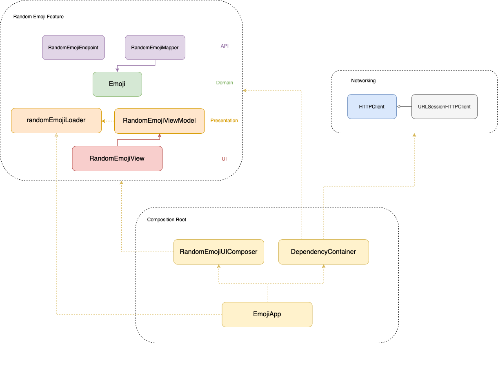

# EmojiApp -- CaseStudy

EmojiApp is a sample app, created purely 

## Requirements

- Display a random Emoji when opening the app
- Show the emoji on the center of the screen
- Display a Random button which will display a new random emoji when tapped

## Model

```ruby
{
    "name": "hugging face",
    "category": "smileys and people",
    "group": "face positive",
    "htmlCode": ["&#129303;"],
    "unicode": ["U+1F917"]
}
```

- Get random emoji
```ruby
GET https://emojihub.yurace.pro/api/random
```

*To see more you can checkout the following repository [emojihub](https://github.com/cheatsnake/emojihub)*

## Architecture Overview


